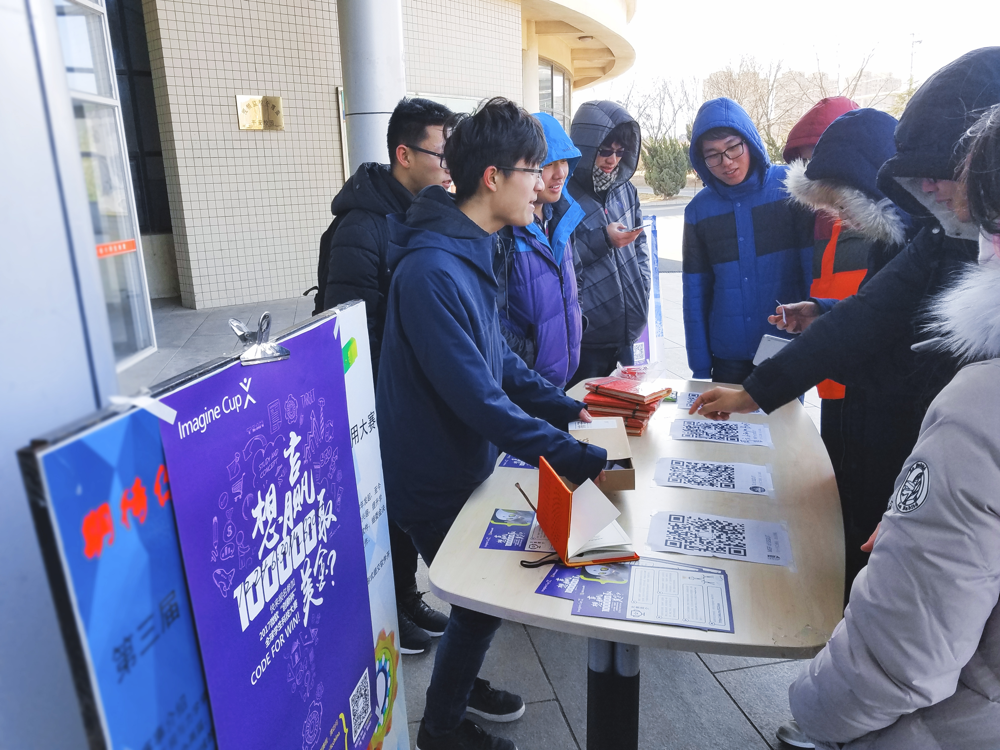

# China 2016 Year in Review

## Imagine Tour of MSP in 2016

Hi all~  
It is so glad to be here and sharing our MSPChina events with all of you MSPs around the world. Let me show you what we Chinese MSPs have done in the year of 2016.

<!-- 
Imagine Tour is the alias of Imagine Cup promotion in China, it's the story of imagination and creation. A pile of engineers, designers, project managers and other creators realize their ideas, motivated with innovations and passion, drived with code,  -->

## Imagine Cup

At the end of April, after several round of area final competition, 2016 Imagine Cup China Local Final was held in Sanya, Hainan province, while thirty MSPs came to Sanya from all around China to participate in 2016 MSP China Summit and record the greate feast of Imagine Cup.

Accompanied by the scorching weather of Sanya, we burst our bigest passion of youth. Follow competitors, shoot the competition and summit, write media broadcast script, stay up the whole night to cut and render videos.

- 2016 Imagine Cup China Local Final Openning

  

- MSPs @Sanya

***For more videos, please visit [Imagine Cup - Youku](http://list.youku.com/albumlist/show/id_27159022.html?spm=a2h0j.8191423.module_basic_info.5~5!2~5~5~5~5~A)***

---

In July, two representative MSPs and the champion of IC China Local Final moved their way to Seattle to participate in MSP Global Summit and Imagine Cup World Final.

The BoneyCare team from China received the Ability Award, which recognizes a student team which is consisted of students from Northeastern University, Beijing Normal University, and UC Berkeley. 

- BoneyCare @IC World Final Award Ceremony

BoneyCare is geared toward advancing accessibility and empowering people with disabilities, for their cloud-based app aimed at helping people who stutter.

- BoneyCare Team

Imagine Cup has always featured innovative projects that are intended to help people living with disabilities. The Ability Award recognizes the team that has best addressed this important topic. BoneyCare will be back to Seattle to improve and perfect their project with the instruction of experts of Microsoft.

---

## On the way

MSP program is not only a organization aimed to help and win the Imagine Cup. On the local final we choreographed and practiced dancing once and once more times for the dinner party of the next day. We trained on the downstairs, in the bathroom, on every moments we got for rest, and we taught each other, we helped each other, during which we became closed partners and friends, brothers in arms. It would huge growth for all of us.

So, the Imagine Tour of 2016 is also the story of growth.

- MSPs @Dinner Party

---

Offline, likewise, we pursue the mission of Microsoft to empower every person and every organization on the planet to achieve more. We make contributions to vivify the community bit by bit, such as promoting classmates and friend around us to watch Microsoft Connect event, teaching high schools and non-computer majors about coding, introducting them with the Hour of Code event. We do also recruit more students with passion to come and join us MSP program and our big family.

### Connect event

##### We gathered our friends together to watch Connect live in the dorm, lab, classroom and so on. The promotion covered amost 20 universities.

  

- Connect event promotion

### Hour of Code

Engineers can just change the world using code in this new era and coding has become more and more common in our daily life. Even computer programming has be urging to brought into primiry school. 

##### We promoted to help teach high schools and non-computer majors to learn programming, and help them achieve more.

  

- University of Electronic Science and Technology of China

  

- Hebei Institute Of Architecture And Civil Engineering

 

- Fujian Police College

  

- Hainan University

##### Then we came to the broader stage and held larger event.

- MSP Recruitment & Imagine Cup 2017 promotion @Dalian University of Technology

##### We convoked more students, and we went outside.

  

- MSP Recruitment & Imagine Cup 2017 promotion @Dalian University of Technology

##### Unsatisfied with the online communicating,  we came to Microsoft Ignite China in Beijing for the offline party.

  

- Microsoft Ignite China Openning

  

- MSPs @Ignite China

  

- Ignite China

##### We went abroad to Seattle and got in touch with MSPs of other countries.

- World Final & MSP Global Summit

- MSP @MVP Summit

It is in the twice Seattle journey, we joined the program of msp-times of APAC and moved our way forward to a broader world. **So here we are.**

### All of the story started from the first step of Imagine Tour.

---

For more information (Chinese Social Media):

  　　　　　