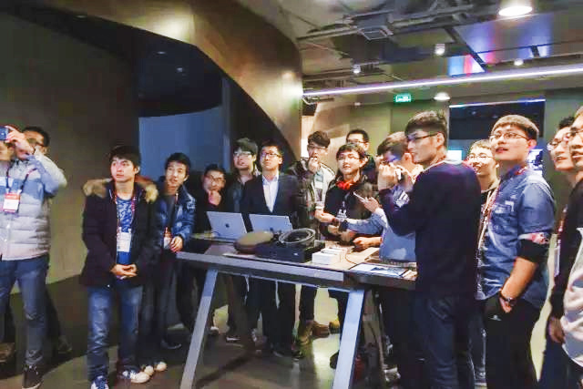

# 2016年 MSP 的创新之旅 

# Tour of Imagination of MSP in 2016.

时值中国的岁末年关，2017年已经逐渐拉开了她的序幕。当我们回首2016年，我们作为 MSP ，这一年里，我们做了什么？让我来为大家走近这一年来，我们可以看到的成长。

微软创新杯在中国的宣传时有一个称号，叫做创新之旅，它讲的是一群工程师，设计师，项目管理者等人，在创新的驱动下，用代码谱写，用PS绘制，无数策划，一起描绘迸发的灵感。对于微软创新杯的参赛者来说，这一年，在创新之旅上走得更坚定，而对于 MSP (Microsoft Student Partners) 呢？

## 创新

4月末，在经历了几轮微软创新杯区域赛，省赛后，中国区总决赛在海南三亚举行，当时几十位天南海北的MSP，赶赴三亚，参与 MSP China Summit 和报道 China Final 这场盛事。

海南炎热的天，为信仰燃烧青春的我们，分组跟进参赛选手，拍摄比赛和大会素材，在网络上进行写稿播报，甚至通宵剪辑视频。

7月，中国区的Overall Leader同角逐出的冠军远赴美国西雅图，微软总部，参见全球总决赛和Global Summit。

BoneyCare团队

又是新的一年了，而我们又在为新一年的微软创新杯积蓄着力量，

我们又开始了新一轮了校园宣传，IC CampusPromotion

ImageShow B站直播

## 实践

MSP其实不仅仅是一个围绕着创新杯而展开的组织，记得在中国区总决赛的时候，笔者和一名高一的MSP要为最后一天的晚会进行排舞，我们在夜晚的楼下，在卫生间对着镜子，练习，编排动作，最后在晚会前教会他人，为我们的节目绞尽脑汁，或许，这对我们来说也是一种成长吧。

所以，其实我更想讲的是，在这一年的创新之旅中，关于我们进步的故事。

在线下，我们更为他人的创新贡献着我们渺小的力量，我们发动身边的同学一起共同观赏关于技术的盛宴——微软 Connect 大会；我们带领大家去动手实践，组织编程一小时活动，在编程中发现乐趣；我们试图用热情，去宣传MSP，让更多的人加入我们这个大家庭。

- Connect 大会

  Build 2016 大会的时候，微软粉丝就像是在过年，在微博上发动态，在微信群里刷弹幕，更有微软科技媒体组织B站的同声传译，和邀请嘉宾进行点评。而更技术向的Connect大会不同于这种发自于对微软的热爱而自行进行观看的活动，作为MSP，要组织大家聚在一起观看视频直播，这个形式其实是有一些难度的，

  从很多MSP的反馈来看，范围不够广，不够吸引人，一直都是线下活动中最突出的矛盾。

  可是MSP是来自群众，走到群众中去也十分容易，于是我们便以寝室为单位，带动身边的同学，一起进行观看。

  

  根据反馈而制成活动照片墙，覆盖近20所高校

- Hour of Code

  这是一个工程师能利用编程改变世界的时代，程序已经逐步渗入我们的日常生活中，更有人呼吁，将编程纳入小学教学。当风靡全球的游戏——“我的世界”，和编程结合在一起，会发生怎样“添码行空”的故事？

  我们逐渐进步，在更大的范围内推广我们的活动。

  ​

  ​

  

  电子科技大学

  ​

河北建筑工程学院

福建警察学院

海南大学

我们开始去感染更多的人，甚至是非计算机领域专业的同学，让他们开始涉猎计算机科学，埋下对编程兴趣的萌芽。

于是，我们开始走向更广大的舞台，我们会举办更大的会议，

MSP Recruitment 大连理工大学

 我们召集更多的人，我们走向户外。

不满足于Build2016般线上的狂欢，我们开始线下面基，前往北京参加Microsoft Ignite China 微软技术大会。

甚至，我们开始走出国门，联络起其他国家的MSP，

MSP in MVP Summit

也正是在World Final和MVP Summit的两次西雅图之行中，我们参与了原先亚太地区MSP兴起的newsletter项目，开始逐渐面向范围更大更广阔的世界。

最开始喜欢上微软的原因是觉得“科技予力众生”“Empower Us All”，这个概念真的太酷了。后来加入了MSP，一起迈上了创新之旅，在这途中，曾被三亚秀丽的景色吸引，也曾艳羡去西雅图大本营的伙伴，然而我觉得最重要的，不是收集到的多少微软纪念品文化衫，而是认识的其他MSP啊，“在同一片天空下，我们彼此，为着共同喜爱的东西，一起进步，即使相隔很远，我们也会有机会见面，我们也会分享喜好，分享彼此的生活，到见面的时候，像是认识多年的老友。”

这一切的一切，都起源于迈上创新之旅的那一步。 

伙伴

Connect大会

Hour of Code

MSP Recruitment

Ignite大会

MVP Summit

四月份 2016 ICLocal Final

七月份 MSP Summit& World Final

十月份 MS ImagineShow

十二月 IC CampusPromotion

